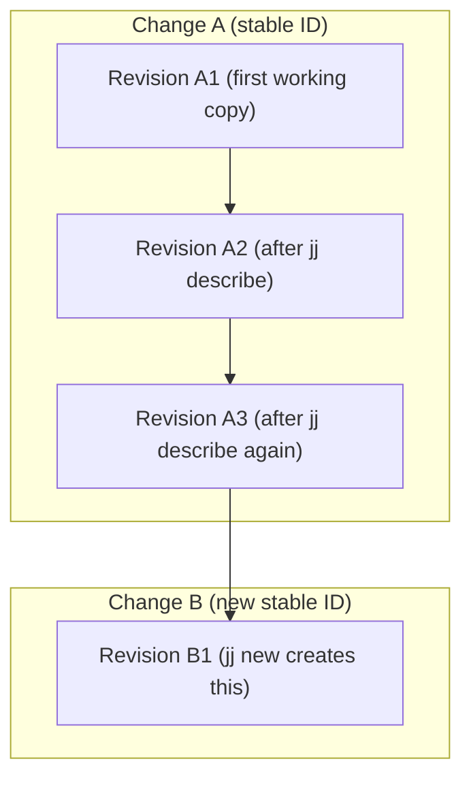

jj

gg

hg

wait...

Hello! Jujutsu, or `jj`, is a newer version control system that can replace Git and these are my notes on using it as I'm learning it.

Someone said that 

> AI is a version control problem

and I very much believe this. Another reason to feed our curiousity in git alternatives.

Most who use `git` will at some point ask themselves: "Why so complicated? Is it me? Is it git? Well, both. Git suffer from decades of history. Git can not just change a command or improve how it works, because it is used everywhere. In software we usually avoid change when possible.

Jujutsu has a unique position in that it's is, or was, not used anywhere. It can learn from years and years of millions of people working with git, mercurial and others daily. And it can give us a fresh take. This article explores Jujutsu from a beginner's perspective and my aim is to be able to use it for myself to start with. 

Since jj uses Git as its backend, you can try it on existing repositories with minimal risk.

To start if you already have a repo:

```sh
jj git clone <repo-url>
```

or

```sh
jj git init --git-repo <path>
```

Coming from git you will be used to working with _commits_. In Jujutsu the fundamental change is called a _revision_ and importantly new revisions are AUTOMATICALLY created as files are changed. You do not need to `git add` anything. As you use `jj log` you can observe the change id staying consistent and the revision id updating with every file change.

I found these references:
- https://jj-vcs.github.io/
- https://v5.chriskrycho.com/essays/jj-init/
- https://steveklabnik.github.io/jujutsu-tutorial/
- https://github.com/jj-for-everyone/jj-for-everyone.github.io

and here's my version:
# The rough guide to Jujutsu (jj)

These are my (edited) notes as I'm trying to understand how jj works. This guide is aimed at people with experience with version control systems, particularly git.

* **Change** → a unit of work with a stable ID (stays open for continued editing)
* **Revision** → a draft of that change (each edit makes a new revision)
* **Working copy `@`** → always a revision; file edits apply directly
* **Bookmark** → a named pointer to a change (independent of graph structure)
* **Revset** → query language for selecting revisions (change IDs, revision IDs, bookmarks, `@`, `@-`, `main..@`)

## Working copy

* The working copy *is itself a commit* (revision)
* Edits to files are auto-tracked — no staging step
* Most `jj` commands create a new revision when you run them (not in background)
* New files are tracked by default; respects `.gitignore`
* To stop tracking a file: `jj file untrack path/to/file`

## First steps

```sh
jj git clone <url>  # → start on fresh working copy `@`, already a new change
# edit files
jj describe -m "Add login form"  # → refine current change (same ID, new revision)
jj new  # → finish current change, start fresh one on top
```

## Everyday flow

See where you are:

```sh
jj status # or jj st

# @- is the parent change, @ is the current change
jj log -r @-
jj log -r 'main..@'
jj show          # show changes in current revision
jj show -r @-    # show changes in parent revision
```

Pause current work to start something else:

```sh
jj new @-          # create new change based on parent, keeping current work
# work on urgent fix
jj new             # back to a fresh change when done
```

Discard unwanted work:

```sh
jj abandon         # discard current revision (work is lost)
jj abandon -r <id> # discard specific revision
```

Move your working copy to a different change:

```sh
jj edit -r main        # go to main (like git checkout main)
jj edit -r @-          # go to parent change
jj edit -r <change-id> # go to specific change
```

Restore specific files from other revisions:

```sh
jj restore --from main file.txt         # restore file from main
jj restore --from @- --to @ file.txt    # restore file from parent to current
jj restore --from @- .                  # restore all files from parent
```

### Selective changes

```sh
jj split -i        # split working copy into two changes (interactive hunks)
jj squash -i       # move hunks into parent change
jj squash <file>   # move whole file into parent
```

This replaces Git's `git add -p` and `git commit --amend -p` workflow. Note: `jj split` is subtractive - you remove what you don't want in the first commit (opposite of Git's additive staging).

### Reshape history

```sh
jj squash           # combine changes
jj diffedit         # edit an earlier change
```

### Conflicts

Unlike git, jj can save conflicts directly in commits. You don't have to fix them immediately. The `<<<<<<<` markers in your files are just how jj shows you the conflict - the real conflict data is stored separately.

```sh
# Option 1: Fix conflicts in a new commit
jj new <conflicted-commit>
# edit files to remove conflict markers
jj squash                   # merge the fix back

# Option 2: Use a merge tool
jj resolve
```

Benefits: you can rebase or merge commits that still have conflicts. Other commits will update automatically even when conflicts exist.

### Undo mistakes

```sh
jj op log             # see all repository operations
jj undo               # undo last operation
jj obslog -r <change> # see how a specific change evolved over time
```

## Describe vs New

In a fresh repo, you usually `jj describe` first. Use `jj new` only when moving on to the next change. Changes have stable IDs that persist through all edits and descriptions.
* **`jj describe`** → updates the the description of the current change. You can keep working on it after this. 
* **`jj new`** → close the current change, begin a new one (without a description) on top.
* **`jj commit`** → shortcut for `jj describe` + `jj new` (Git-style workflow).
### Bookmarks (branches)

In jj you won't deal with branches as you know them from Git. Instead you create _bookmarks_ when you want to share changes. You can work on anonymous changes until you're ready to sync:

```sh
jj bookmark create feature-name    # create bookmark at current change
jj git push -c feature-name        # push and create remote bookmark
```

Or let jj auto-generate bookmark names when pushing:

```sh
jj git push -c @                   # auto-generates bookmark name
```
### Sync with remotes

```sh
jj git fetch                        # updates local view of remote bookmarks
jj rebase -d main                   # restructures your change to sit on top of main
jj bookmark create feature-name     # create bookmark for sharing
jj git push -c feature-name         # push new bookmark (-c = create)
```
### Merging into main (fast-forward)

```sh
# After rebasing onto main, move the main bookmark to your change
jj bookmark set main -r @           # moves bookmark pointer (doesn't change graph)
jj git push --bookmark main         # pushes bookmark movement to remote
```

Revset flexibility: Use change IDs (`nrtvnxuk`), revision IDs (`fea9ae77`), bookmarks (`main`, `feature-name`), or symbols (`@`, `@-`) interchangeably with `-r`. Jj shows unique prefixes in output - type just the highlighted characters.

## Why jj feels different

* Always a commit: no staging/index
* Rewrite is safe and expected
* Conflicts are data, not just errors
* Intermediate revisions stay local - only your final change gets pushed to the remote
* `jj diff` shows what's in your current revision, not "uncommitted changes" (since everything is always committed)
* History is shaped into the story you want to tell
* Compatible with Git, but not limited by it

## Cheatsheet

### Status & History

* `jj status` → see working copy
* `jj log -r <revset>` → explore history
* `jj show` → view changes in current revision

### Working on Changes

* `jj describe` → refine current change
* `jj new` → start a new change
* `jj abandon` → discard unwanted revisions
* `jj split -i` → split working copy
* `jj squash -i` / `<file>` → amend into parent

### File Operations

* `jj restore --from <rev> <file>` → restore files from revisions

### Reshaping

* `jj squash` / `jj diffedit` → reshape history

### Conflicts

* `jj resolve` → resolve conflicts

### Undo

* `jj op log` / `jj undo` → backtrack operations
* `jj obslog -r <change>` → see change evolution

### Remotes

* `jj bookmark create <name>` → name current change
* `jj git fetch` / `jj git push -c <name>` → sync

### Workspaces

* `jj workspace add/forget` → manage multiple workspaces

**Takeaway**: In jj, you don’t “stage then commit.” You live inside a change, refining it with `describe`, splitting and squashing as needed. Use `new` only when you’re ready for the next change.


